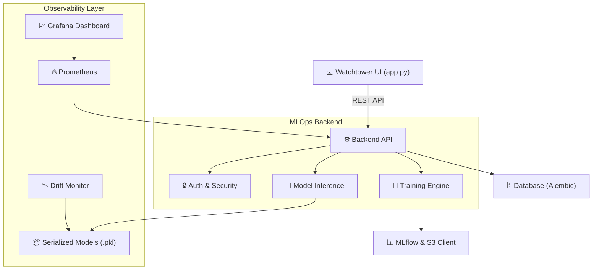

<div align="center">

# 🗼 Watchtower: End-to-End MLOps & Model Monitoring Platform

**📈 Data Drift Detection • 🔍 Production Inference • 📊 Prometheus/Grafana Observability • 🧠 MLflow Integration**

[](https://www.python.org/)
[](#)
[](#)
[](#)
[](#)
[](#)

Watchtower is a production-ready Machine Learning Operations (MLOps) architecture designed to serve, manage, and monitor predictive models seamlessly. It bridges the gap between raw data science and software engineering by providing automated drift monitoring, experiment tracking, structured database migrations, and a fully integrated observability stack.

<br>

</div>

## 🚀 System Overview

Deploying a model is only the first step. Watchtower is engineered to handle the complete lifecycle of ML models in production. It features a robust Python backend for orchestrating training and inference, alongside a dedicated user interface and a comprehensive telemetry pipeline.

The platform is pre-configured with a suite of predictive models (Breast Cancer, Diabetes, California Housing, Iris, and Wine Quality) to demonstrate real-world scaling, logging, and monitoring capabilities.

---

## ✨ Core Capabilities

### 🧠 Model Serving & MLOps
*   **RESTful Inference API:** Scalable backend endpoints for model training, real-time predictions, and secure file uploads (`backend/app/api/v1/`).
*   **Experiment Tracking:** Built-in service clients for MLflow (`mlflow_client.py`) and Amazon S3 (`s3client.py`) for centralized model artifact management.
*   **Automated Retraining:** Backend infrastructure (`trainer.py`) to trigger and manage model retraining workflows.

### 🛡️ Production Reliability
*   **Data Drift Monitoring:** A dedicated standalone engine (`scripts/drift_monitor.py`) to track statistical changes in incoming data against reference datasets (`Data_sets/`) to prevent model degradation.
*   **Database Versioning:** Utilizes Alembic (`alembic/`) to manage structured, reproducible database schema migrations.
*   **Inference Auditing:** Automatically logs detailed inference requests and model decisions (`logs/inference.log`) for compliance and debugging.

### 📊 Observability & UI
*   **Native Telemetry:** Ships with a pre-configured Prometheus setup (`monitoring/prometheus/prometheus.yml`) for scraping system and API metrics.
*   **Grafana Dashboards:** Includes a centralized Grafana database (`grafana_data/grafana.db`) and alerting templates for visual performance tracking[cite: 3].
*   **Interactive Web UI:** Features a standalone frontend application (`watchtower-ui/app.py`) for analysts to interact with the models directly[cite: 3].

---

## 🏗️ Architecture & Component Workflow



---

## 📂 Project Structure
```text
watchtower-prod/
├── 📁 alembic/                  # Database migration scripts and environments
├── 📁 backend/                  # Core API service
│   ├── 📁 app/
│   │   ├── 📁 api/v1/           # Endpoints: auth, monitoring, predict, training, uploads
│   │   ├── 📁 core/             # Security configurations and settings
│   │   ├── 📁 db/               # Database sessions and ORM models
│   │   └── 📁 services/         # MLflow, S3, and Model Training logic
│   ├── Dockerfile               # Backend container configuration
│   └── requirements.txt         # Backend dependencies
├── 📁 Data_sets/                # Reference CSV datasets for drift calculation
├── 📁 grafana_data/             # Grafana configurations, databases, and alerts
├── 📁 logs/                     # Persistent inference and MLflow logs
├── 📁 monitoring/               # Prometheus YAML configuration
├── 📁 scripts/                  # Machine Learning assets
│   ├── drift_monitor.py         # Data drift analysis script
│   ├── 📁 Models/               # Pre-trained models (.pkl)
│   └── 📁 Model_scripts/        # Prediction logic for specific models
├── 📁 watchtower-ui/            # Frontend application
│   ├── app.py                   # UI entry point
│   └── Dockerfile               # UI container configuration
├── docker-compose.yml           # Multi-container orchestration
└── railway.json                 # Cloud deployment configuration
```

---

## 🛠️ Quickstart & Deployment

Watchtower is highly containerized, allowing for seamless local development and immediate cloud deployment.

### 1️⃣ Local Orchestration (Docker Compose)
The easiest way to spin up the API, UI, and Observability stack simultaneously is via Docker Compose
```bash
# Clone the repository
git clone https://github.com/PrathamBhanushali30/watchtower-ai.git
cd watchtower-prod

# Build and start all services
docker-compose up --build
```

### 2️⃣ Manual Setup
If you prefer running components individually in virtual environments:
```bash
# Backend Setup
cd backend
python -m venv venv
source venv/bin/activate
pip install -r requirements.txt
python app/main.py

# UI Setup (in a separate terminal)
cd ../watchtower-ui
pip install -r requirements.txt
# Run the app
python app.py
```

### 3️⃣ Cloud Deployment
This project includes a `railway.json` file, making it instantly deployable to the Railway cloud platform via their CLI or GitHub integration

---

## 🖥️ Interacting with the Watchtower UI

Once the application is deployed, the frontend provides a streamlined, interactive control center for managing your MLOps lifecycle without needing to interact directly with the backend APIs.

---

## 🌐 Accessing the Dashboard

Open your web browser and navigate to the port exposed by the UI container (`typically http://localhost:8501` or `http://localhost:3000` depending on your local configuration).

---

## ⚙️ Key Workflows

The frontend application (`watchtower-ui/app.py`) serves as your primary interaction point. You can use the interface to perform the following operations:

* 🔮 Real-Time Inference & Predictions:

 * Select your target model from the deployed suite (e.g., Breast Cancer SVM, Diabetes RF, California Housing GB, Iris Classifier, or Wine Quality RF).

 * Input raw feature values or upload batch files to generate predictions via the backend's `/api/v1/predict` endpoint.

* 📤 Data Ingestion & Uploads:

 * Use the file uploader tool to securely ingest new scoring data or update reference datasets (e.g., `cancer_reference.csv`, `housing_reference.csv`). This interfaces directly with the `/api/v1/uploads` endpoint.

* 🔄 Triggering Model Retraining:

 * When data drift is detected or new data becomes available, you can initiate a model retraining job directly from the UI. This interacts with the `/api/v1/training endpoint`, triggering the underlying `trainer.py` engine and updating MLflow.

* 📊 Drift Monitoring & Observability:

 * Navigate to the monitoring dashboard to review the health of your models. This section pulls data from the `/api/v1/monitoring` endpoint to display metrics calculated by the `drift_monitor.py` script.

 * Note: For advanced telemetry, the UI will guide you to your dedicated Grafana instance (powered by the integrated `grafana.db` and Prometheus metrics) for deep-dive visualizations.

---

## 👨‍💻 About the Author
Pratham Bhanushali

*M.Tech — Artificial Intelligence & Data Science*
*Specialization: Cybersecurity & OT Security*

Passionate about the intersection of Artificial Intelligence and robust systems engineering. Focused on designing secure, scalable architectures, SOC automation, and ensuring the reliability of machine learning models in production environments.
